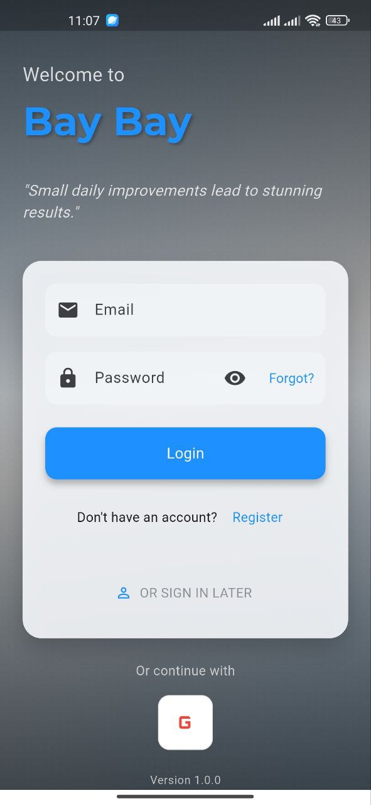
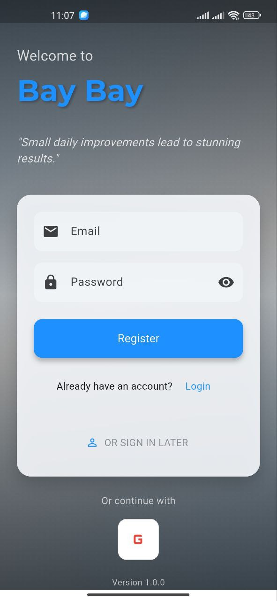
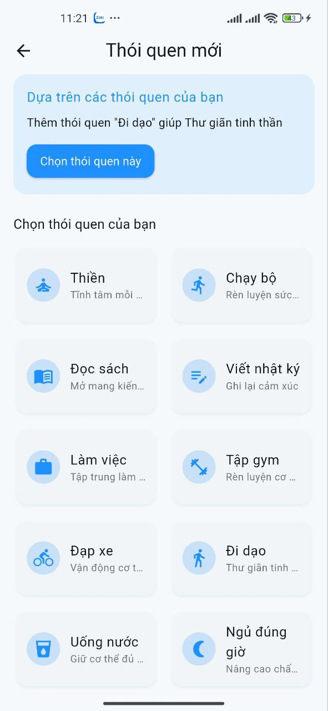
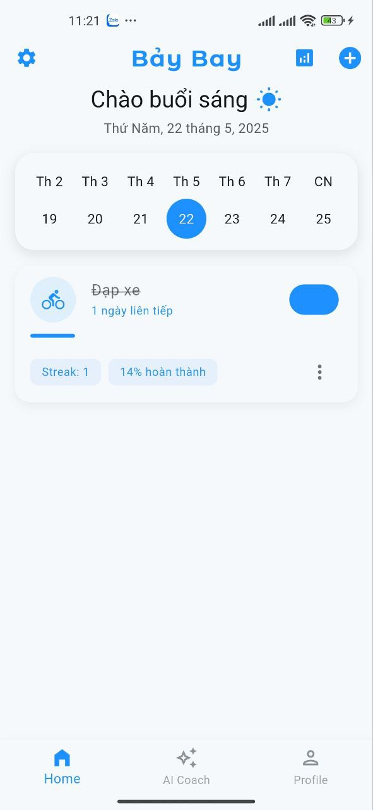
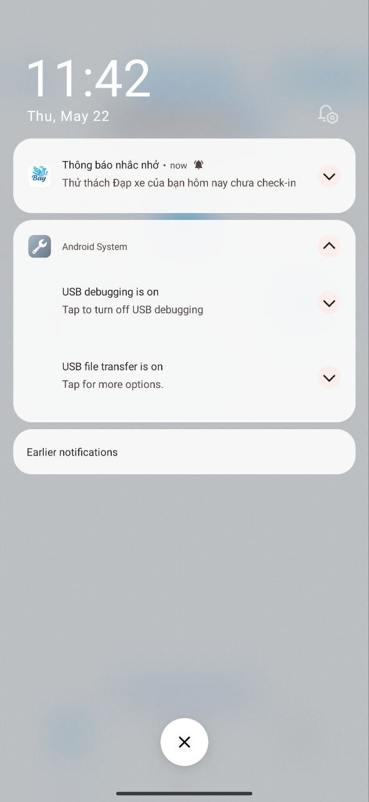

# Thử Thách 7 Ngày – Ứng dụng tạo thói quen tích cực với AI

Thử Thách 7 Ngày là một ứng dụng di động giúp người dùng xây dựng và duy trì thói quen tốt thông qua các thử thách kéo dài 7 ngày. Ứng dụng tích hợp trí tuệ nhân tạo để đưa ra lời khuyên, phân tích sai lầm phổ biến và đề xuất thử thách phù hợp với mục tiêu cá nhân.

## 🚀 Tính năng nổi bật

- ✅ Danh sách các thử thách có sẵn với mô tả chi tiết, mục tiêu từng ngày
- 🧠 Tích hợp AI để:
  - Giải thích lý do khoa học đằng sau thử thách
  - Cảnh báo những sai lầm phổ biến
  - Gợi ý cải thiện phù hợp
- 🛠️ Hệ thống tự tạo thử thách theo yêu cầu người dùng
- 🔥 Giao diện thân thiện, hiện đại, hỗ trợ trải nghiệm mượt mà trên Android

---

## 🛠️ Công nghệ sử dụng

| Công nghệ       | Mô tả |
|----------------|-------|
| Flutter (Dart) | Framework phát triển giao diện đa nền tảng |
| Firebase       | Authentication, Cloud Firestore, Cloud Functions |
| Gemini API     | Tích hợp AI hỗ trợ cá nhân hoá thử thách |
| Provider       | Quản lý trạng thái ứng dụng |
| Figma          | Thiết kế giao diện người dùng (UI/UX) |

---

## 📷 Ảnh minh họa

    

---

## ⚙️ Hướng dẫn cài đặt

### 1. Clone dự án

```bash
git clone https://github.com/TungduongNTD/thuthach7ngay.git
cd thuthach7ngay
```

### 2. Cài đặt dependencies

```bash
flutter pub get
```

### 3. Cấu hình Firebase

- Truy cập [Firebase Console](https://console.firebase.google.com/), tạo project mới
- Tải `google-services.json` và đặt vào thư mục `android/app/`
- Kích hoạt Firebase Authentication, Firestore và Functions nếu có dùng

### 4. (Tuỳ chọn) Cấu hình OpenAI API

- Tạo file `.env` và thêm dòng sau:

```env
GEMINI_API_KEY=your_api_key_here
```

- Sử dụng thư viện như `flutter_dotenv` để load biến môi trường trong code

### 5. Chạy ứng dụng

```bash
flutter run
```

---

## 📂 Cấu trúc thư mục

```plaintext
lib/
├── main.dart
├── constants/         # Các hằng số dùng chung
├── firebase_options.dart
├── models/            # Các model dữ liệu
├── providers/         # Quản lý trạng thái với Provider
├── screens/           # Các màn hình giao diện chính
│   ├── ai_chat/
│   ├── home/
│   ├── login/
│   └── splash/
├── services/          # Các hàm xử lý logic như AI, Firebase, Auth,...
├── utils/             # Tiện ích và hàm dùng chung
└── widgets/           # Các widget tái sử dụng
```

---

## 📌 Ghi chú

- Ứng dụng ưu tiên Android, chưa tối ưu hoàn toàn cho iOS
- Một số tính năng AI yêu cầu kết nối internet ổn định
- Dự án phục vụ mục đích học tập và nghiên cứu, không thương mại hóa

---

## 📧 Liên hệ

Nguyễn Tùng Dương – [tungduong2003@gmail.com]  
Sinh viên – Đại học Công Nghệ Thông Tin & Truyền Thông ICTU
Đồ án tốt nghiệp: Phát triển ứng dụng thử thách 7 ngày

---

> 💡 Nếu thấy dự án hữu ích, hãy ⭐ star repo này nhé!
